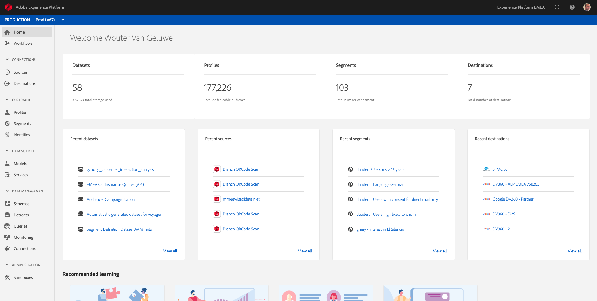
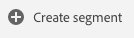
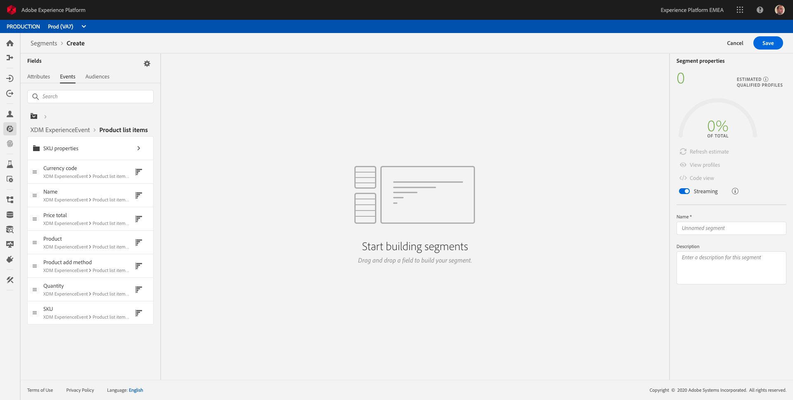

## Exercise 11.1 - Build a segment and enable Streaming Segmentation

In this exercise, you'll create a segment by making use of Adobe Experience Platform's new unified segmentation experience.

The URL to login to Adobe Experience Platform is: [https://platform.adobe.com](https://platform.adobe.com)

### Story

In today's world, responding to a customer's behaviour needs to be real-time. One of the ways of responding to customer behaviour in real-time is by using a segment, on the condition that the segment qualifies in real-time. In this exercise, you need to build out a segment, taking into account real activity on the website that we've been using. 

### Identify the behaviour you want to react to...

Go to your SYTYCD-website.

You'll be redirected to the ``Admin``-page


  
On the ``Admin``-page, go to ``Select LDAP`` (for Module 11, selecting an LDAP is a requirement). Select your LDAP and click ``Save``.


Go back to the ``Admin``-page.


Go to ``Select Brand``.
  

  
Select a brand from the list of available brands. Click ``Save``. In this example, we'll use ``Luma Retail``.
  

  
Wait 10 seconds for the brand to load.
  
Go to the Homepage


In this example, I want to respond to a specific customer viewing a specific product. 
By scrolling down on the ``Luma Retail``-homepage, I can see multiple products and I'm going to pick the product ``Nadia Elements Shell``.


So when somebody visits the product page for ``Nadia Elements Shell``, I want to be able to take action. The first thing to do to take action, is defining a segment.


### Create the Segment

To create the segment as defined above, log in to Adobe Experience Platform by going to this URL: [https://platform.adobe.com](https://platform.adobe.com)

After logging in, you'll land on the homepage of Adobe Experience Platform.



In the menu on the left side, go to ```Segments```.


On this page, you can see an overview of all existing segments.


Click on the ``Create Segment``-button to start creating a new segment.



As defined above, I'd like to build a segment out of all customers that have viewed the product ``Nadia Elements Shell``.

To build out this segment, you need to add an Experience Event. You can find all Experience Events by clicking on the ```Events``` - icon in the ```Segments``` - menu bar.


Next, you'll see the top level ``XDM ExperienceEvent``-node.


To find customers that have visited the ```Nadia Elements Shell``` - product, click on ```XDM ExperienceEvent```.


Scroll down to ```Product List Items``` and click it.


Select ```Name``` and drag and drop the ```Name```-object from the left ```Product List Items``` - menu onto the segment builder canvas into the ```Events```- section.




The comparison parameter should be ```equals``` and in the input field, enter ```Nadia Elements Shell```.


Every time you add an element to the segment builder, you can click the ``Refresh Estimate``-button to get a new estimate of the population in your segment.

Finally, let's give your segment a name and save it.

As a naming convention, we'll use:

  * ldap - Interest in Nadia Elements Shell (RTCDP - ldap)

Please replace **ldap** with your assigned number, like this:
**vangeluw - Interest in Nadia Elements Shell (RTCDP - vangeluw)**


It's also important to note the ``Streaming`` - switch.


By enabling the ``Streaming``-switch, your segment will qualify in real-time and will be available for activation in real-time.

Then, click the ```Save``` - button to save your segment, after which you'll be taken back to the Segment overview - page.


When you now go back to the SYTYCD - website and refresh the homepage, you should see the Streaming Segment that you just built already qualify for your profile on the Xray-panel.


---

Next Step: [Exercise 11.2 - Review how to configure DV360 Destination using Destinations](./ex2.md)

[Go Back to Module 11](./README.md)

[Go Back to All Modules](../README.md)
