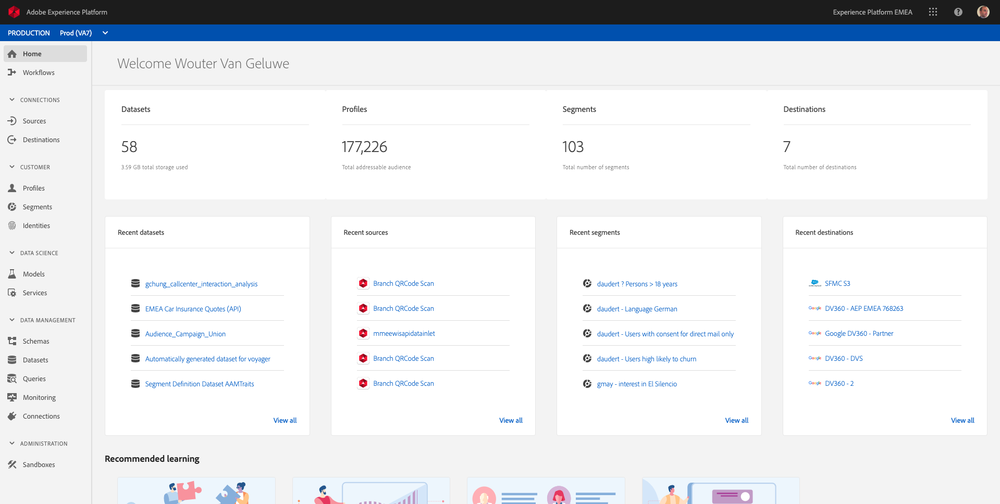
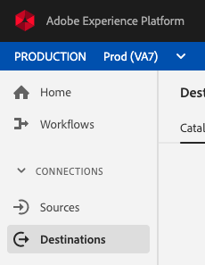
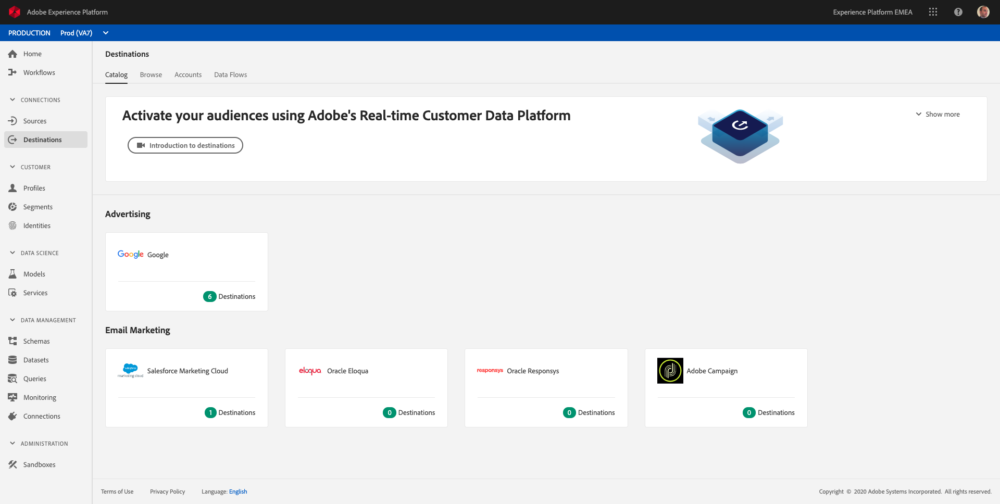
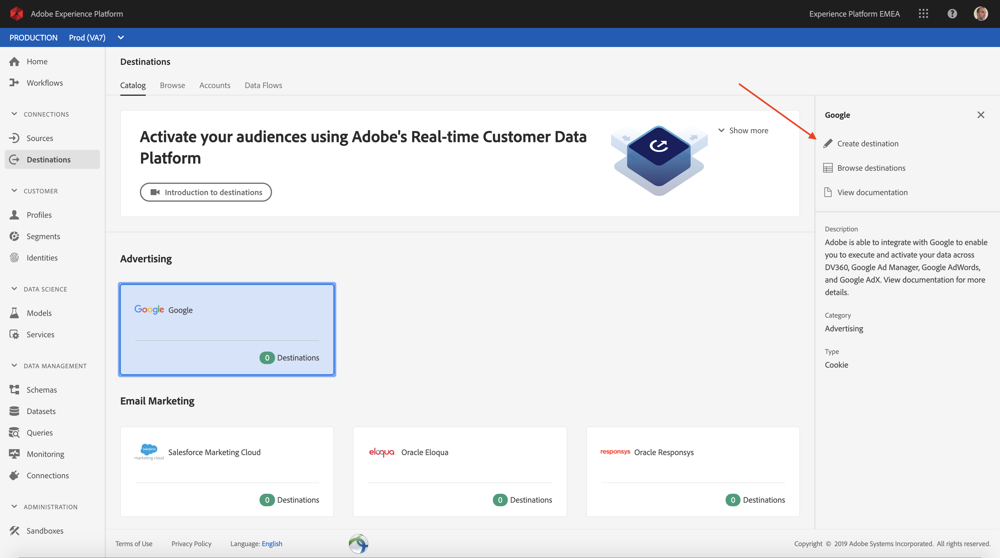
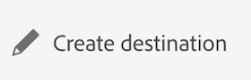
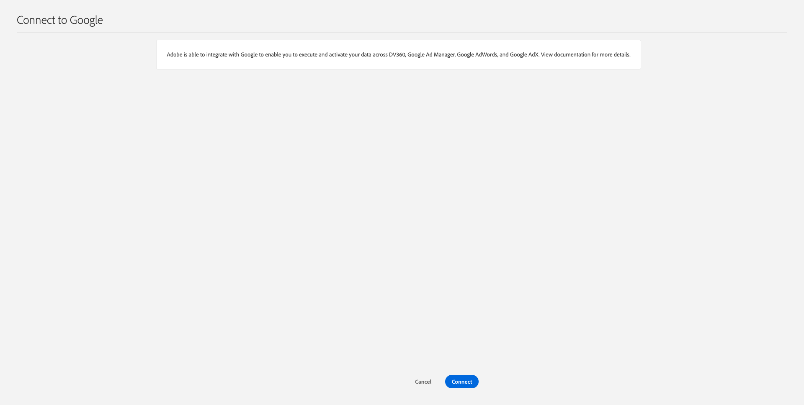
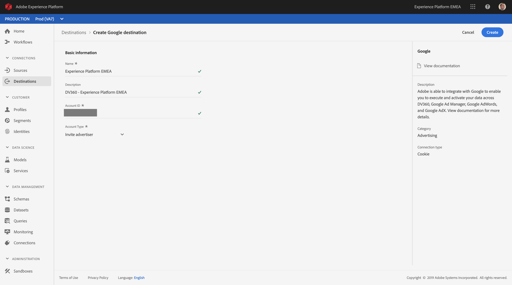
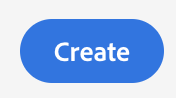
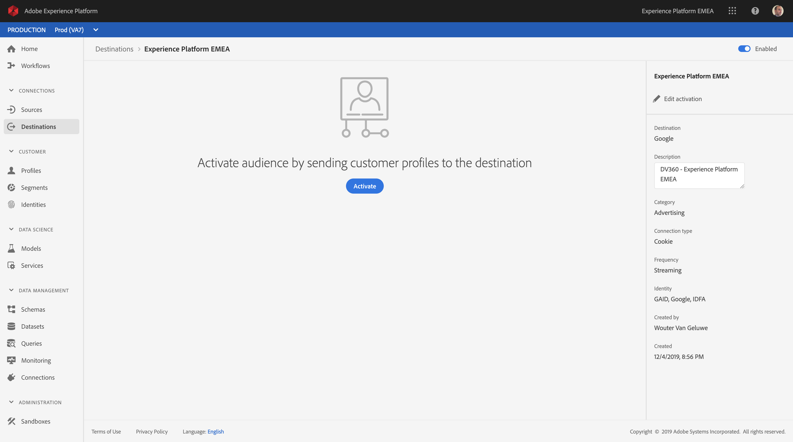

## Exercise 11.2 - Configure an Advertising Destination like Google DV360

**IMPORTANT**

The below content is intended as FYI - You do **NOT** have to configure a new destination for DV360. The destination has already been created and you can use it in the next exercise.

**IMPORTANT**

Log in to Adobe Experience Platform by going to this URL: [https://platform.adobe.com](https://platform.adobe.com)

After logging in, you'll land on the homepage of Adobe Experience Platform.

Before you continue, make sure you are in the ``Production Prod (VA7)``-environment in the blue line on top of your screen.

In the left menu, go to ``Destinations``.

You'll then see the ``Destinations``-homepage.

In ``Destinations``, click on ``Google``.

Click on ``Create Destination``.

Click ``Connect`` on the next screen.

In the next screen, you'll see the Self-Service UI to configure your destination to Google DV360.

Enter a value in the fields ``Name`` and ``Description``.
The field ``Account ID`` is the ``Advertiser ID`` of the DV360 Account. You can find that here:

The ``Account Type`` should be set to ``Invite Advertiser``. 

FYI - If you have configured DV360/DBM integrations in the past for Adobe Audience Manager projects, it was also required to contact Google for this setup and request Google to ``whitelist`` Adobe to send segments to DV360/DBM. This step is still required and as such, Google needs to witelist Adobe in order for Adobe Experience Platform to speak with Google DV360.

Click ``Create`` to create your destination.

After creating the destination, you can find it in the Destinations Catalog.. 

In the next exercise, you'll connect the segment you built in the previous exercise to the Google DV360 destination.

---

Next Step: [Exercise 11.3 - Take Action: send your segment to DV360](./ex3.md)

[Go Back to Module 11](./README.md)

[Go Back to All Modules](../README.md)
