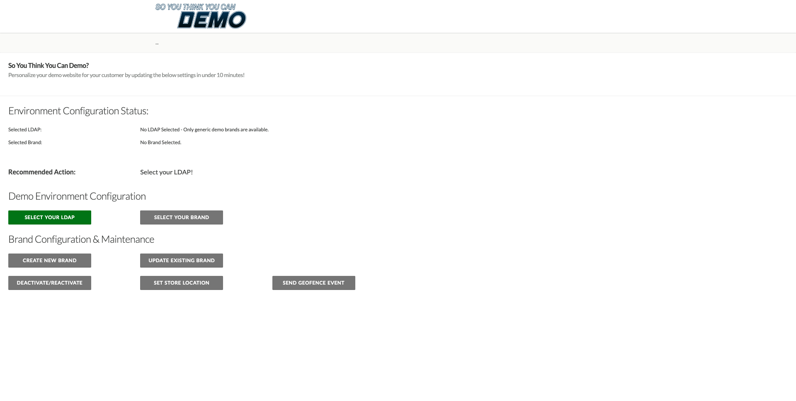
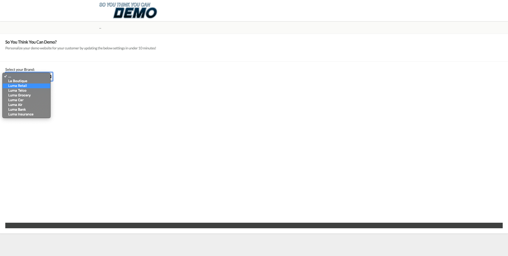

## Exercise 12.5 - Trigger your Orchestrated Customer Journey

In this exercise, you'll test and trigger the Orchestrated Journey you configured in this module.

  * Go to [https://platformdemo.net/](https://platformdemo.net)

  * You'll be redirected to the ``Admin``-page

  
  
  * On the ``Admin``-page, click ``Select Brand``.
  
  
  
  * Select a brand from the list of available brands. Click ``Save``.
  
  
  
  * Wait 10 seconds for the brand to load.
  
  * Go to the Homepage
  
  
  
  * Go to the Register/Login page
  
  **IMPORTANT**
  
  Please use the following naming convention for your Mobile Phone Number:
  
  If your number is 0473622044, you have to enter **+32473622044+DDMMYYYY-XX** as a number, otherwise the sending of SMSs doesn't work. For instance, **+32473622044+19012020-11**
  
  **IMPORTANT**
  
  
 
  * Fill out your registration details and click ``CREATE ACCOUNT``.
  
  * After login, go to the Homepage of the website and open the X-ray panel, go to Real-time Customer Profile. On the X-ray panel, you should see all of your personal data displayed.
  
  

 * In the website's menu, click on the ``3 dots`` and select ``Admin``.
 
  
 
 * You'll then see the ``Admin`` - page. Click ``Send Geofence Event``.
 
  
 
 * Click ``Send Geofence Event``.
  
  
 
 * On the ``Send Geofence Event``-page, click ``Allow`` on the prompt to ``Know your location``.
  
  
  
 * After 1-2 seconds (sometimes this can take up to 1-2 minutes), you'll see the coordinates, city and country of your approximate location. Once the coordinates are shown, you have to enter your Orchestration eventID from Exercise 1. In this example, the ``eventID`` is ``780733565e9819142b46f7e920256891caeb0dbed3cf654af956a6dfe7486125 ``.
  
  

* Click ``Send Geofence Event``. You'll get a visual confirmation when the Geofence Event has been sent.

  

* You should then receive a SMS Message on the Mobile Phone that was attached to your Real-time Customer Profile. The SMS Message will depend on the current weather and the temperature, just like you configured in your Journey.

  
 
* The same message will also be sent to the Adobe Hands-On Lab Slack channel. Your instructor is able to show you the received messages in the Slack channel. This Slack Channel is #emeaplatformtraining-location in the ACS - Adobe Consulting Workspace, so feel free to add yourself to it to see your events qualifying.
  
  

If you've received your SMS Message, you've successfully completed this module.  

---

[Go Back to Module 12](./README.md)

[Go Back to All Modules](../README.md)
