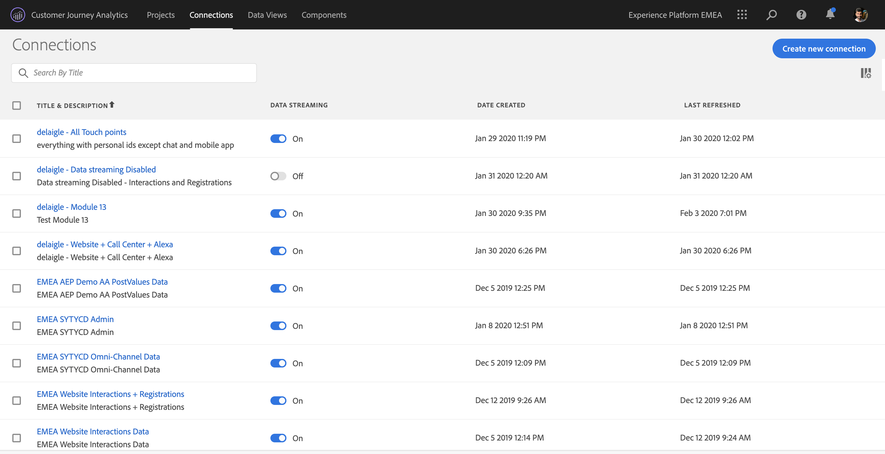

# Exercise 13.1 - Connect Adobe Experience Platform datasets in CJA

## Objectives

- Understand the Data Connection UI
- Bring Adobe Experience Platform data into CJA
- Understand Person ID and data stitching
- Learn the concept of data streaming in Customer Journey Analytics

## 13.2.1 Your First Connection

Go to [analytics.adobe.com](https://experience.adobe.com/#/@experienceplatform/platform/analytics/#/workspace) to access Customer Journey Analytics.

Make sure you to select the organisation ``	[INSERT IMS ORG NAME]``.

On the Customer Journey Analytics-homepage, go to ``Connections``. 

Here you can see all the different connections made between CJA and AEP. These connections have the same goal as report suites in Adobe Analytics. However, the collection of the data is totally different. All data is coming from Adobe Experience Platform datasets. 

Let's create your first connection. 

Click ``Create new connection``.

You'll then see ``Create Connection``-UI.

There are 3 different areas. Let's start from the left side.

1.	Here, you'll find all the available AEP datasets.
2.	Here is the drag-and-drop area for the datasets you want to connect to.
3.	This is the stitching area, where you’ll select the Person Id.

## 13.2.2 Select Adobe Experience Platform datasets
First, let's bring some datasets to the canvas. There are two ways: one by one or selecting some of them and click on add. We can try both.

Search for the dataset ``[INSERT WINT DS NAME]``, then click ``+``.

You'll see the dataset being added to the canvas.

Now search and check the checkboxes for ``	[INSERT CALLC DS NAME]`` and ``	[INSERT VOICEA DS NAME]``. 

Next, click ``Add``.

## 13.2.3 Person ID and Data Stitching

### Person ID

The goal now is to join these datasets. If you look at the right side you’ll see a field called ``Person ID``. 

Each data source has its own Person ID field. Check each dataset by clicking on them.

As you can see, most of them have the Person ID selected automatically. This is because a Primary Identifier is selected in every schema in Adobe Experience Platform. 

However, you can still influence which identifier will be used to stitch datasets together for your connection. You can use any identifier that is configured in the schema linked to your dataset. Click on the dropdown to explore the IDs available on each dataset.

As mentioned, we can set different Person IDs for each dataset. This allows you to bring different datasets from multiple origins together in CJA. Imagine bringing in NPS or survey data which would be very interesting and helpful to understand the context and why something has happened.

The name of the Person ID field isn't important, as long as the value in the Person ID fields correspond. Let say we have ``EMAILID`` in one dataset and ``EmailAdress`` in another dataset defined as Person ID. If ``delaigle@adobe.com`` is the same value for the Person ID-field on both datasets, CJA will be able to stitch the data.

At this point, you may wonder, will the full ID Graph of Adobe Experience Platform's Real-time Customer Profile be available for stitching the data? This is part of the H2 2020 roadmap.
Currently, CJA brings data directly from the datasets and isn't aware of the Real-time Customer Profile yet. That’s why, at this moment, you have to manually define the Person ID to get to the 360° view of the customer. 

Currently there are some other limitations such us stitching the anonymous behaviour to known. Please review the FAQs here: [FAQ] (https://docs.adobe.com/content/help/en/analytics-platform/using/cja-overview/cja-faq.html). 

### Stitching the data using the Person ID
Now that you understand the concept of stitching datasets using the Person ID, let's choose ``emailId`` as your Person ID for each dataset. 

Select each dataset clicking on it. 

Now fill the field Person ID choosing the ``emailId`` on the dropdown list.

Once you have stitched the 3 datasets, we are ready to continue. 

|  dataset       | Person ID  	    | 
| ----------------- |-------------| 
| 	[INSERT WINT DS NAME] | emailId         | 
| 	[INSERT CALLC DS NAME] | emailId          | 
| 	[INSERT VOICEA DS NAME] | emailId         | 

Click on Next.

## 13.2.4 Connection - Naming & Streaming

Here you need to give a name to your connection. 

Please use this naming convention: ``ldap – Omnichannel Data Connection``. 

Example: ``delaigle - Omnichannel Data Connection``

Before finishing, please also activate ``Data Streaming`` as in the image below. 

This will start a data flow from Adobe Experience Platform to CJA every 60 minutes, however with high volumes of data it can take up to 24 hours. If you don't activate the ``Data Streaming``-option, Adobe Experience Platform and CJA will load historical data but will not load new data/hits. FYI: backfilling of AEP data is not available yet in CJA.

After having created your ``Connection`` it may take a few hours before your data is available in CJA.

Click ``Save`` and go to the next excercise. 

---

[Next Step: Exercise 13.3 - Create a Data View](./ex3.md)

[Go Back to Module 13](./README.md)

[Go Back to All Modules](./../../README.md)

