# Exercise 3.3: Use your Alexa skill

Using your Alexa skill is dependent on whether you

1. have an Alexa device with a display, or not (and in that case use the simulator),
2. want to switch login, brands and email address on the fly.

Option 2 is not possible when you're using a real Alexa device with a display as the Alexa device is unable to properly interpret a spoken login name or email address.

So in order to accommodate all scenarios you can use your Alexa skill in two ways:

1. With the login, brand and email address pre-configured as part of the Lambda function.
*Then you can use both a **real device with a display**, as well as the Alexa **simulator**.*

2. With the login, brand and email address not pre-configured or (partially) pre-configured but with the additional requirement to change these values on the fly.
_Then you can only use the Alexa **simulator**_.

## Exercise 3.3.1: Use your Alexa skill on a real device with a display

(**Note**: Screenshots are based on Alexa Spot device; if you use another device, screens will look differently).

To demonstrate your Alexa skill and its interaction with AEP on a real Alexa device that has a display (Echo Spot, Echo Show, etc.):

1. Ensure you are device is setup with the Amazon developer account you created earlier.

2. Ensure you have provided correct values for **ldap**, **alexaBrandName** and **emailAddress** in the AWS Lambda **aep** function definition's **Environment Variables** panel. See [Exercise 3.2](../define/README.md) for more details.

3. Say `Alexa, open Adobe Experience Platform`. Alternatively you can replace `ask` with `open`,  `load`, `tell`, `begin` or `enable`.
   - You will get the following response from Alexa:
   ```Welcome to the Adobe Experience Platform skill for Alexa. The skill is ready for immediate use on a real device. Say, Alexa, help, to get more information on how to use this skill!```. This prompt indicates that you have configured the Lambda skill's function correctly.
   If required configuration information is missing (e.g. **ldap**, **alexBrandName** and/or **emailAddress**), you will receive the following response from Alexa:
   `Welcome to the Adobe Experience Platform skill for Alexa.`
   - You will see the following screen on your device:
   
4. Say `Alexa, help` to get more information on how to use the skill.
   - You will get the following response from Alexa:
   ```First Say Alexa, get products to load all products, then say Alexa, get product followed by a number to get details about a specific product. After this you can say Alexa, add to cart to add the selected product to the shopping cart. And then say Alexa, purchase to purchase the selected product.```.

5. Say `Alexa, get  products` to get a list of products for the selected brand (in our example Luma Retail)
   - You will get the following response from Alexa (based on the number of products in the catalog for the specific brand):
   ```We got 33 products. Use a number between 1 and 33 to get more details about a product. E.g. say Alexa, get product 8```.
   - You will see a screen like:
   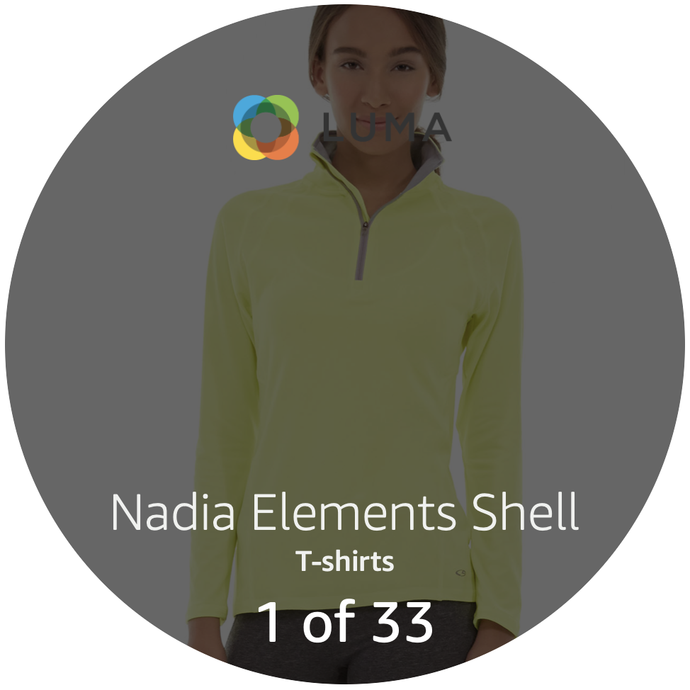
   - You can use touch to slide from left to right through the different products, e.g. going to product 17. Your screen will then look like:
   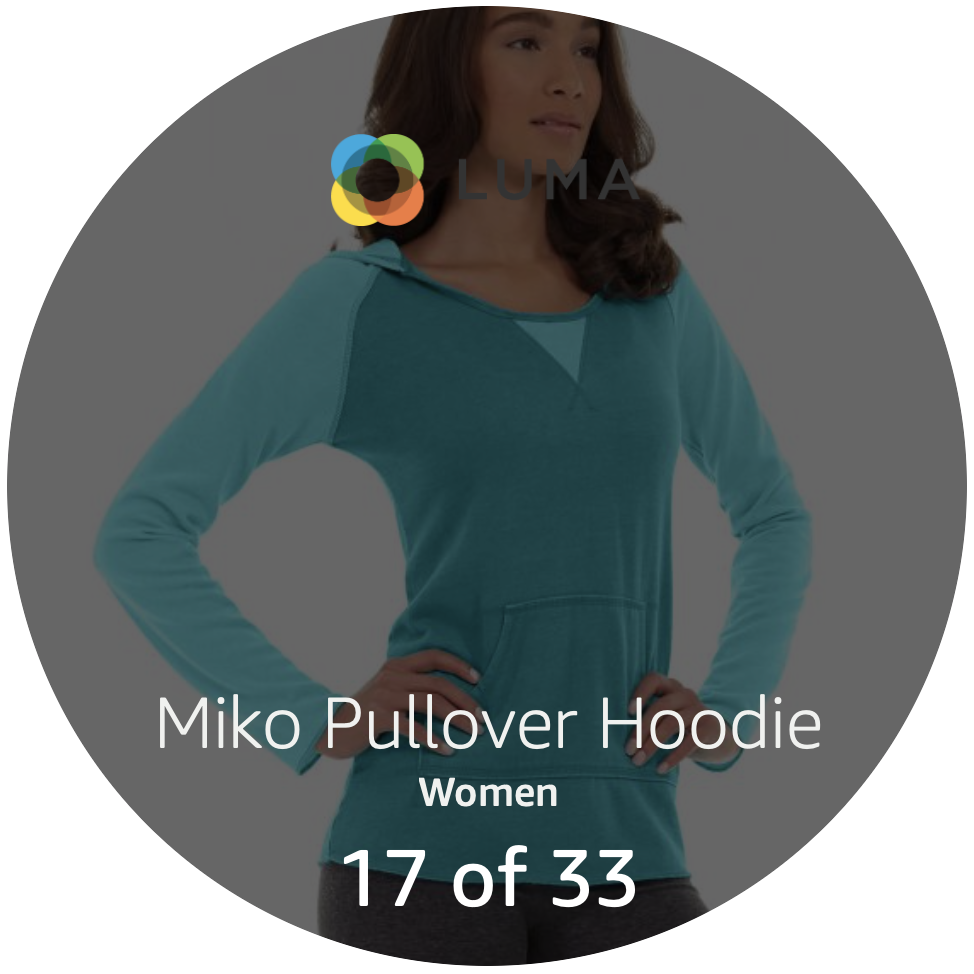
6. Say `Alexa, get product seventeen` (or any other valid product number for that matter).
   - You will get the following response from Alexa (again, based on the product you selected):
   ```You have selected Miko Pullover Hoodie from the category Women with a price of 69 euro. You can add the product to your shopping cart by saying Alexa, add product to cart```.  
   - You will see a screen like:
   
   - This intent will fire a **productView** experience event using the specified email address as the profile identification to the Adobe Experience Platform.
   - You can scroll upwards to read more of the description and see the price of the product.
**Note**: You can use also use touch to select a product, rather than asking Alexa.
7. Say `Alexa, add product to cart`.
    - You will get the following response from Alexa:
    ```We have added Miko Pullover Hoodie to your shopping cart. Thank you!```
    - You will see a screen like:
    
    - This intent will fire a **productAddToCart** experience event using the specified email address as the profile identification to the Adobe Experience Platform.
8. Say `Alexa, purchase product`.
    - You will get the following response from Alexa:
    ```We have added Miko Pullover Hoodie to your shopping cart. Thank you!```
    - You will see a screen like:
    
    - This intent will fire a **productPurchase** experience event using the specified email address as the profile identification to the Adobe Experience Platform.

You can repeat step 6, 7 and 8 to fire additional Adobe Experience Platform experience events.

## Exercise 3.3.2: Use your Alexa skill with the Alexa simulator

You can still demonstrate your Alexa skill and its interaction with AEP, even if you do not have a real Alexa device with a display.

To do this:

1. Go to your **AWS Lambda** definition screen for **aep**.
   1. You have the option to remove the following specific configuration key value pairs in **Environment Variables** for your demonstration: `ldap`, `alexaBrandName`, `emailAddress` as you can specify them in the simulator.
   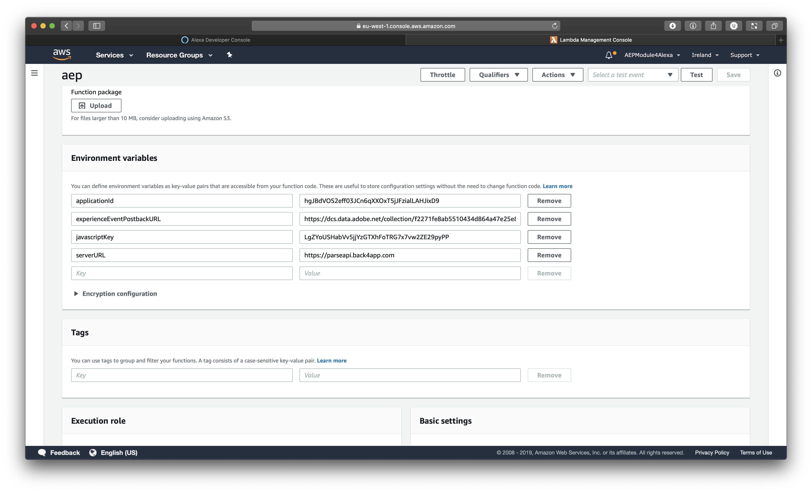
   2. Save the **Environment variables**.
2. If you are not logged in to your **alexa developer console** and within your **aep** skill.
   1. Login to your Amazon developer account.
   2. Go to **Alexa** > **Alexa Skills Kit**.
   3. Click on the **AEP** skill you created as part of [Exercixe 3.2](../define/REAMDE.md).
   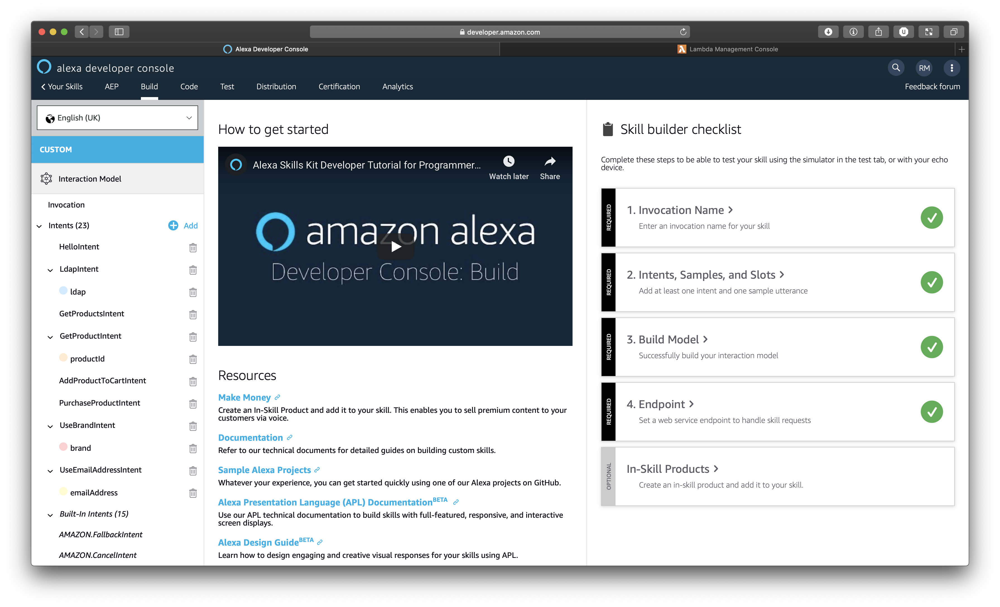
3. In the **aep** skill definition screen within the **alexa developer console**:
   1. Click on **Test**. You might be prompted if you want to allow use of the microphone. It's up to you to see whether that works. The instructions here are using text input for simulating the conversation.
   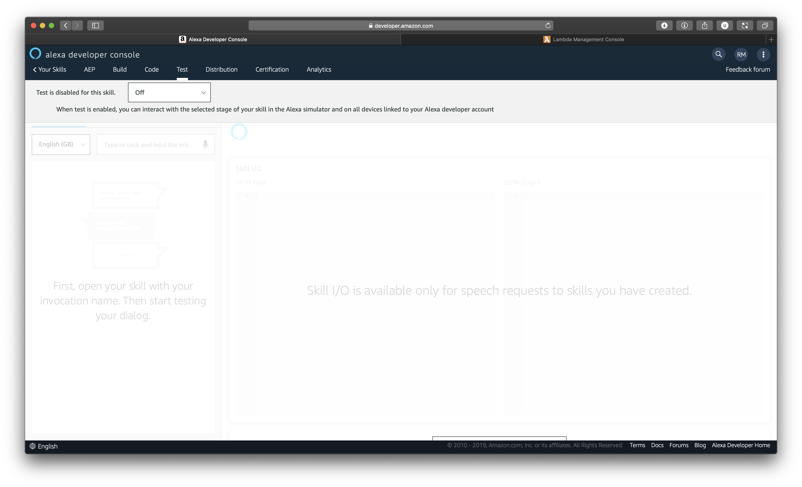
   2. Ensure you select `Development` from **Skill testing is enabled in:**
   3. Ensure the **Alexa Simulator** tab is selected.
   4. Select the language you have developed your skill in from the language dropdown list (e.g. `English (GB)`)
   5. Unselect **Skill I/O**, select **Device Display** and unselect **Device Log**.
   You screen should now look like:
   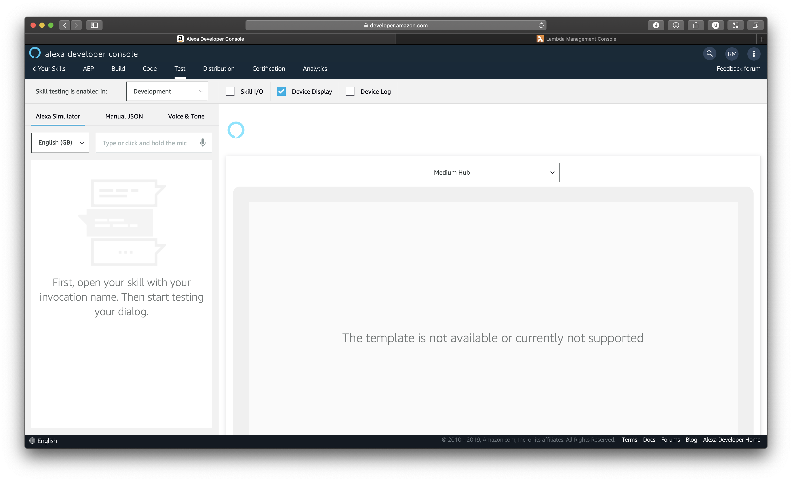
4. Select the type of device you want to use for your demonstration, e.g. `Small Hub` (Echo Spot) or `Medium Hub` (Echo Show) or another one from the dropdown list.
5. Open the skill by entering `ask adobe experience platform` in the **Typoe or click and hold the mic**.
Your screen should look like:
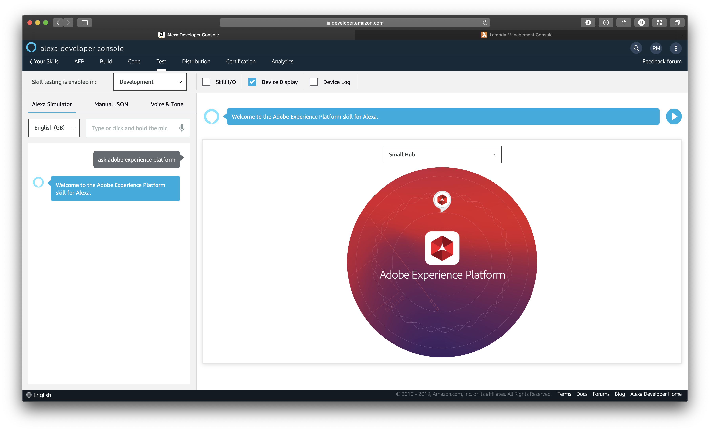
6. Assuming you have not configured environment variables in your Lambda function for **ldap**, **alexaBrandName** and **emailAddress** or want to configure them on the fly, specify these in the simulator:
   1. Type `login rmaur` to login. Replace `rmaur` with your LDAP name.
   The simulator will respond with `Great you are logged in as rmaur`.
   Your screen should look like:
   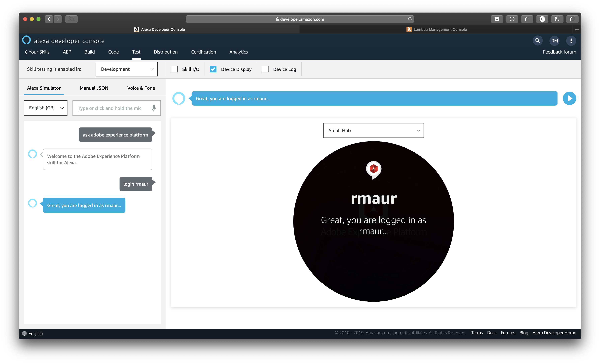
   **Note**: The login is used to determine to which brands you will do have access.
   2. Type `use brand luma retail` to select the brand you want to use for your demonstration. Replace `luma retail` with the brand name you want to use.
   The simulator will respond with `You have selected a valid brand for the Adobe Experience Platform skill.`
   Your screen should look like:
   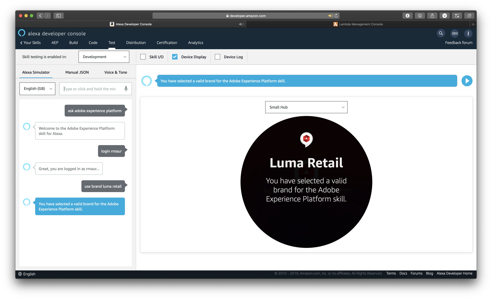
   If you would have specified a brand you do not have access to, the simulator will respond with `You have no permission to use the selected brand for the Adobe Experience Platform skill.`
   3. Type `use email rmaur+18062019-1@adobe.com` to specify your specific email address you want to use for the demonstration. Replace `rmaur+18052019-1@adobe.com` with your specific email address. Remember, that email address will be used to identify the experience events.
   The simulator will respond with `You will use rmaur+18062019-1@adobe.com as the email address for the Adobe Experience Platform skill.`.
   Your screen should look like:
   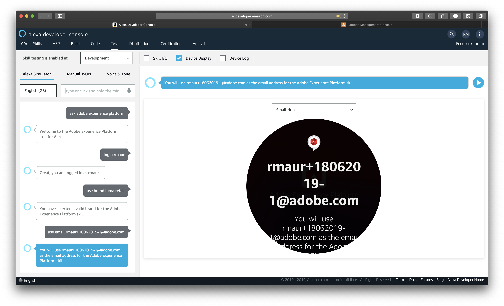
7. You are now all set to demonstrate the brand and product interaction using the simulator.
   1. Type `get products` to get products.
   The simulator will respond with `We got 33 products. Use a number between 1 and 33 to get more details about a product. E.g. say Alexa, get product 8`.
   Your screen should look like:
   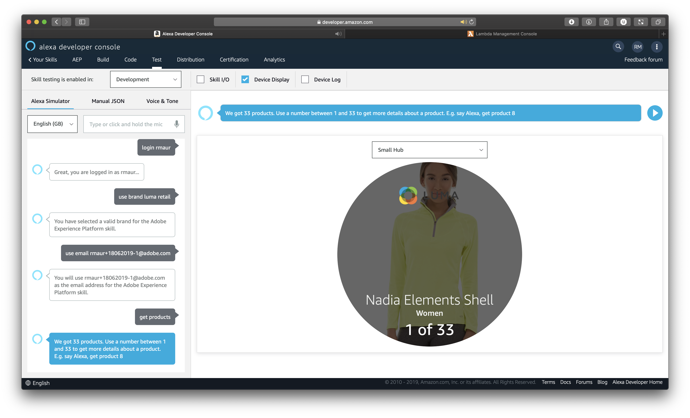
   2. Type `get product 17` to get product 17.
   The simulator will respond with `You have selected Miko Pullover Hoodie from the category Women with a price of 69 euro. You can add the product to your shopping cart by saying Alexa, add product to cart`.
   Your screen should look like:
   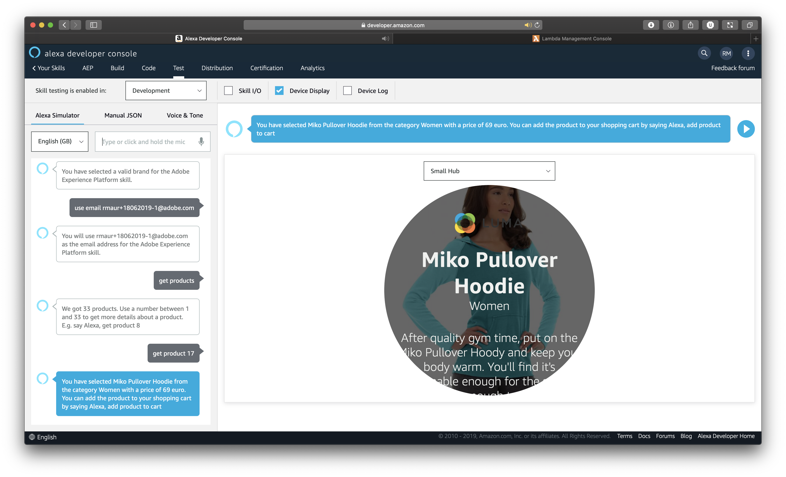
   3. Type `add product to cart` to add the product to the cart.
   The simulator will respond with `We have added Miko Pullover Hoodie to your shopping cart. Thank you!`.
   Your screen should look like:
   
   4. Type `purchase product` to purchase the product.
   The simulator will respond with `You have purchased Miko Pullover Hoodie. Thank you so much!!`.
   Your screen should look like:
   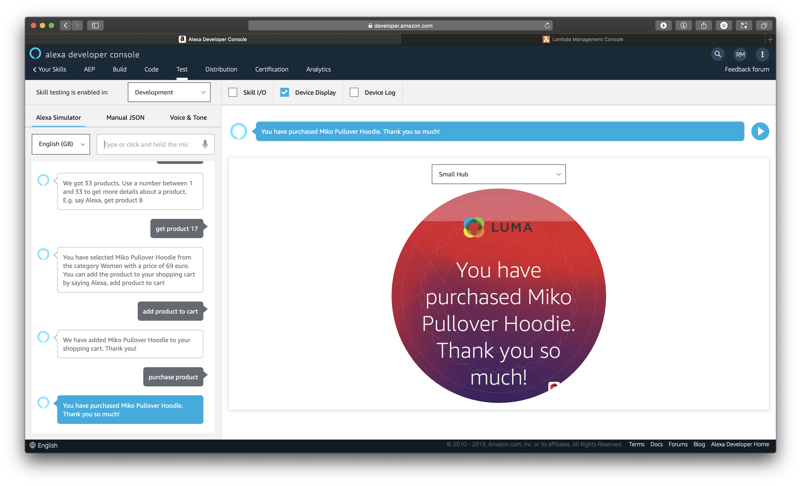

Using the simulator you can change your environment on the fly by configuring different values as explained in step 6 above.

## Exercise 3.3.3: Viewing the result in Adobe Experience Platform

You can view the experience events generated by your Alexa skill (either the real device or simulator). To do so:

1. Login to the [Adobe Experience Platform](https://platform.adobe.com/home).
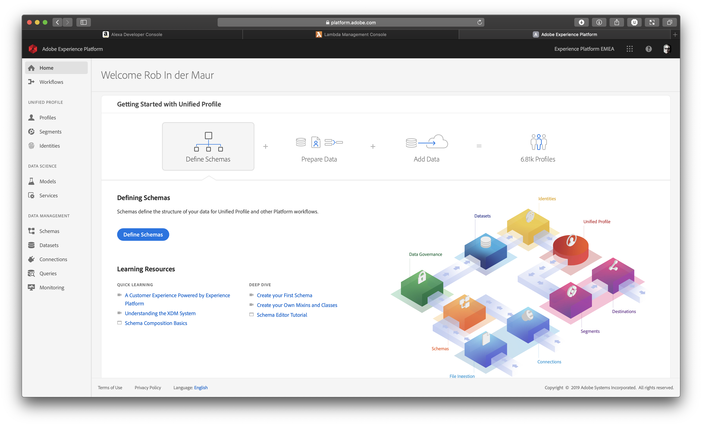
2. Click on **Datasets**.
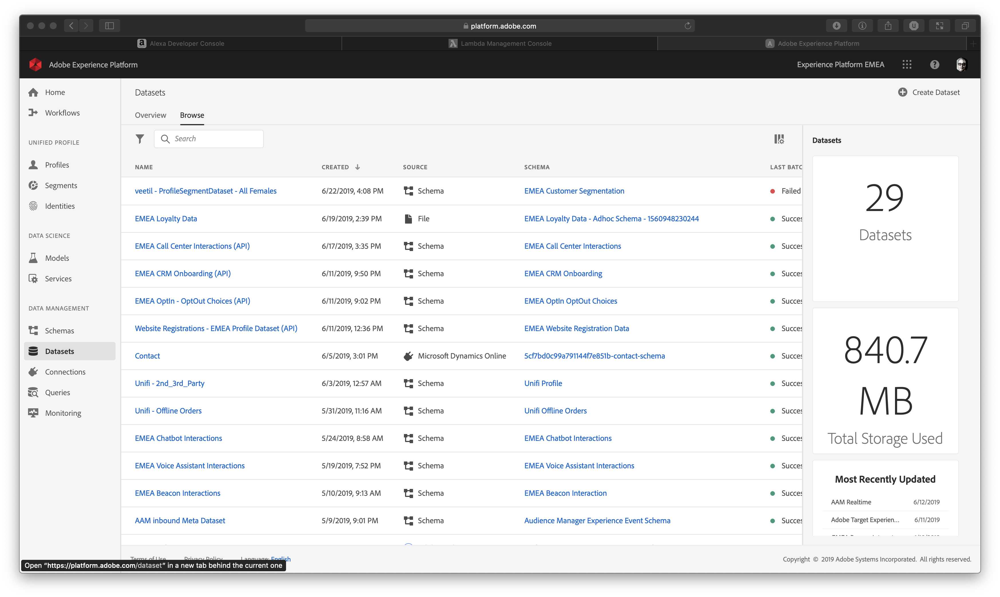
3. Click on **Browse**.
4. Select **EMEA Voice Assistant Interactions**.
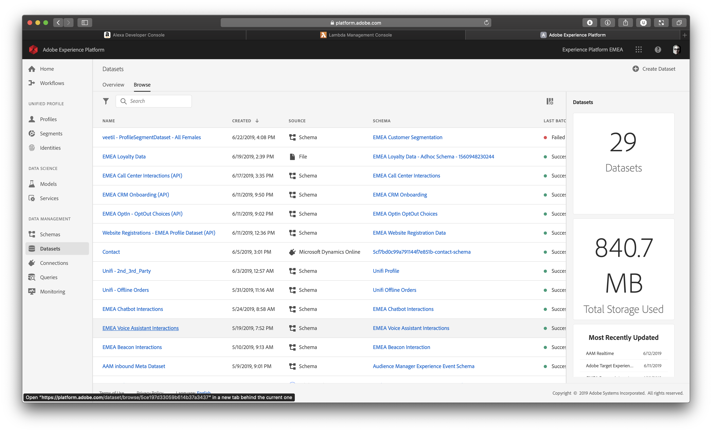
5. You should see your Alexa interactions appearing after a while as in the screen below:


You have finished this exercise. Go to [next exercise](../demo/README.md) to continue this module.

[Go Back to All Modules](../README.md)
