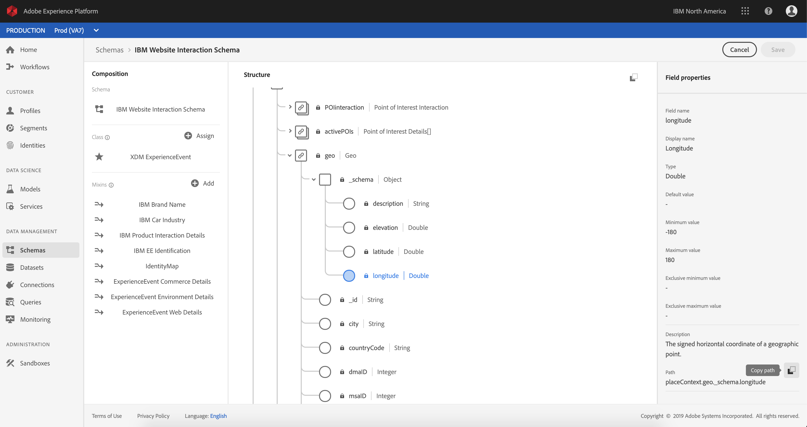

# Exercise 4.2 - Using the Query Service

## Objective

- Find and explore datasets
- Learn how to address Experience Data Models objects and attributes in your queries


## Exercise Context

In this exercise you will learn how to use PSQL to retrieve information about the available datasets, how to write a queries for Experience Data Model (XDM), and write your first simple reporting queries using the Query Service and Luma Telco datasets.

## Exercise 4.2.1

In this exercise you will learn about the methods to retrieve information about the available datasets and how to properly retrieve data with a query from an XDM dataset.

All the datasets hat we have explored via Adobe Experience Platform UI in the beginning of exercise 1, are also available for access via a SQL interface as tables. To list those tables you can use the ``show tables;`` command.

Execute **show tables;** in your **PSQL command-line interface**. (do not forget to end your command with a semicolon).

Copy the command ``show tables;`` and paste it at the **all >** prompt:


You will see the following result:

```text
prod:all=> show tables;
                   name                   |        dataSetId         |                  dataSet                   | description | resolved
------------------------------------------+--------------------------+--------------------------------------------+-------------+----------
 aep_demo_midvalues                       | 5dd4812346fc3e18a9ea64c1 | AEP Demo midValues                         |             | false
 aep_demo_postvalues                      | 5dd481247643d218a8dc150a | AEP Demo postValues                        |             | false
 emea_loyalty_data                        | 5dd502055463db18aa77fcd3 | EMEA Loyalty Data                          |             | false
 ibm_call_center_interactions_api         | 5dd393ecc7314818a8cfdbb5 | IBM Call Center Interactions (API)         |             | false
 ibm_crm_onboarding_api                   | 5dd3938cf9da3b18a8395f26 | IBM CRM Onboarding (API)                   |             | false
 ibm_mobile_app_interactions_api          | 5dd393a458c3cb18b5289a67 | IBM Mobile App Interactions (API)          |             | false
 ibm_website_interactions_api             | 5dd39344f89cfd18a82fd420 | IBM Website Interactions (API)             |             | false
 ibm_website_registration_information_api | 5dd3936c7ce95d18a8729783 | IBM Website Registration Information (API) |             | false
(8 rows)
```

At the colon, press space bar to see the next page of the resultset, or enter ``q`` to revert to the command prompt.

Every dataset in Platform has its corresponding Query Service table. You can find a dataset's table via the Datasets ui:


The ``ibm_website_interactions_api`` table is the Query Service tables that corresponds with the ``IBM Website Interactions (API)   `` dataset.

To see the ``root`` schema of a table, like for example ``ibm_website_interactions_api``, you use ``\d`` command.

Copy the command ``\d ibm_website_interactions_api `` and paste it at the **all >** prompt in your **PSQL command-line interface**.:


The result should look like:

```text
prod:all=> \d ibm_website_interactions_api
                                        Table "public.ibm_website_interactions_api"
            Column            |                           Type                            | Collation | Nullable | Default
------------------------------+-----------------------------------------------------------+-----------+----------+---------
 eventtype                    | text                                                      |           |          |
 timestamp                    | timestamp                                                 |           |          |
 _ibmnaamericaspartnersandbox | ibm_website_interactions_api__ibmnaamericaspartnersandbox |           |          |
 _id                          | text                                                      |           |          |
 productlistitems             | productlistitems_e[]                                      |           |          |
 commerce                     | commerce                                                  |           |          |
 web                          | ibm_website_interactions_api_web                          |           |          |
 placecontext                 | ibm_website_interactions_api_placecontext                 |           |          |
 environment                  | ibm_website_interactions_api_environment                  |           |          |

```

To query some information about where a product was viewed, we will select the ``geo`` information.

Copy the statement below and paste it at the **all >** prompt in your **PSQL command-line interface** and hit enter:

```sql
select placecontext.geo
from   ibm_website_interactions_api
where  _ibmnaamericaspartnersandbox.productData.productInteraction = 'productView'
limit 1;
```

In your query result, you will notice that columns in the Experience Data Model (XDM) can be complex types and not just scalar types. In the query above we would like to identify geo locations where a ``productView`` did occur. To identify a ``productView`` we have to navigate through the XDM model using the ``.`` (dot) notation.

```text
prod:all=> select placecontext.geo
prod:all-> from   ibm_website_interactions_api
prod:all-> where  _ibmnaamericaspartnersandbox.productData.productInteraction = 'productView'
prod:all-> limit 1;
                  geo                   
----------------------------------------
 ("(57.4694803,-3.1269422)",GB)
(1 row)
```

Notice the result is a flattended object rather than a single value? The ``placecontext.geo`` object contains four attributes: schema, country and city. And when an object is declared as a column it will return the entire object as a string. The XDM schema may be more complex than what you are familiar with but it's very powerful and was architected to support many solutions, channels, and use cases.

To select the individual properties of an object, you use the ``.`` (dot) notation.

Copy the statement below and paste it at the **all >** prompt in your **PSQL command-line interface**:

```sql
select placecontext.geo._schema.longitude
      ,placecontext.geo._schema.latitude
      ,placecontext.geo.countryCode
from ibm_website_interactions_api
where  _ibmnaamericaspartnersandbox.productData.productInteraction = 'productView'
limit 1;
```

The result of the above query should look like:
The result is now a set simple values:

```text
prod:all=> select placecontext.geo._schema.longitude
prod:all->       ,placecontext.geo._schema.latitude
prod:all->       ,placecontext.geo.countryCode
prod:all-> from   ibm_website_interactions_api
prod:all-> where  _ibmnaamericaspartnersandbox.productData.productInteraction = 'productView'
prod:all-> limit 1;
 longitude  |  latitude  | countrycode
------------+------------+-------------
 -3.1269422 | 57.4694803 | GB
(1 row)
```

Don't worry, there is an easy way to obtain the path towards a specific property. In the following part you will learn how.

You will need to edit a query, so let's first open an editor.

On Windows

Click the ``search``-icon in the windows toolbar, type **notepad** in the ``search``-field, click the ``notepad`` result:


On Mac

Install Brackets from https://github.com/adobe/brackets/releases/download/release-1.14/Brackets.Release.1.14.dmg if you don't have it installed and follow the instructions. After installation, search for ``Brackets`` via Mac's spotligt search and open it.

Copy the following statement to notepad or brackets:

```sql
select <your_attribute_path_here>
from   ibm_website_interactions_api
where  _ibmnaamericaspartnersandbox.productData.productInteraction = 'productView'
limit 1;
```


Go back to your Adobe Experience Platform UI (should be open in your browser) or navigate to http://platform.adobe.com.

Select ``Schemas``, enter **Web** in the ``search``-field and select **IBM Website Interactions Schema** from the list.


Explore the XDM model for ``IBM Website Interactions Schema``, by clicking on de the object, you can expand the tree, do this for ``placecontext``, ``geo`` and ``schema``. When you select the actual attribute ``longitude``, you will see the complete path in the highlighted red box. To copy the attribute's path, click on the copy path icon.



Switch to you notepad/brackets and remove **<your_attribute_path_here>** from the first line. Position your cursor after ``select`` on the first line and paste (CTRL-V).

Copy the modified statement from notepad/brackets and paste it at the **all >** prompt in your **PSQL command-line interface** and hit enter.

The result should look like:

```text
prod:all=> select placeContext.geo._schema.longitude
prod:all-> from   ibm_website_interactions_api
prod:all-> where  _ibmnaamericaspartnersandbox.productData.productInteraction = 'productView'
prod:all-> limit 1;
 longitude  
------------
 -3.1269422
(1 row)
```

Next Step: [Exercise 4.3 - Queries, queries, queries...  and churn analysis](../exercises/3-queries.md)

[Go Back to Module 4](../README.md)

[Go Back to All Modules](../../README.md)
