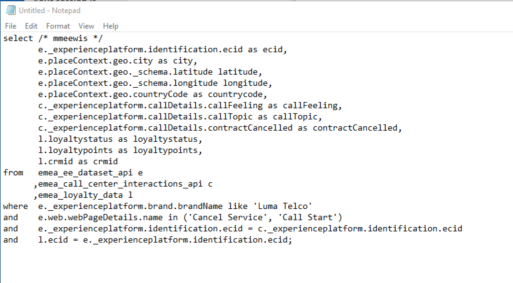
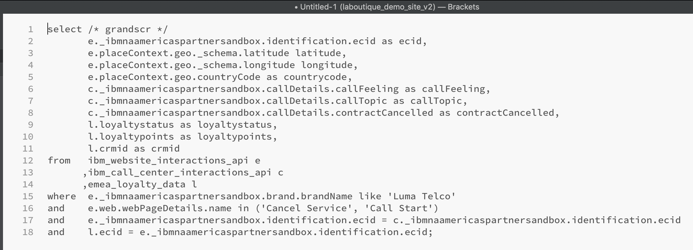

# Exercise 4.3 - Queries, queries, queries,... and churn analysis

## Objective

- Write queries for data analyses
- Write SQL queries combining online, callcenter and loyalty data avialable in Adobe Experience Platform
- Learn about Adobe Defined Functions

## Lesson Context

In this exercises you will write queries to analyse product views, product funnels, churn etc.

All queries listed in this chapter will be executed in your **PSQL command-line interface**. You should copy (CTRL-c) the statement blocks indicated with **SQL** and paste (CTRL-v)them in the **PSQL command-line interface**. The **Query Result** blocks show the pasted SQL statement and the associated query result.

## Exercise 4.3.1

Write basic queries for data analysis

### Timestamp

Data captured in Adobe Experience Platform is time stamped. The "timestamp" attribute allows you to analyse data over time.

How many product views do we have on a daily basis?

**SQL**

```sql
select date_format( timestamp , 'yyyy-MM-dd') AS Day,
       count(*) AS productViews
from   ibm_website_interactions_api
where  _ibmnaamericaspartnersandbox.brand.brandName like 'Luma Telco'
and    _ibmnaamericaspartnersandbox.productData.productInteraction = 'productView'
group by Day
limit 10;
```

Copy the statement above and execute it in your **PSQL command-line interface**.

**Query Result**

```text
prod:all=> select date_format( timestamp , 'yyyy-MM-dd') AS Day,
prod:all->        count(*) AS productViews
prod:all-> from   ibm_website_interactions_api
prod:all-> where  _ibmnaamericaspartnersandbox.brand.brandName like 'Luma Telco'
prod:all-> and    _ibmnaamericaspartnersandbox.productData.productInteraction = 'productView'
prod:all-> group by Day
prod:all-> limit 10;
    Day     | productViews
------------+--------------
 2019-08-20 |         2185
(1 row)

```

### Top 5 products viewed

What are the top 5 products viewed?

**SQL**

```sql
select _ibmnaamericaspartnersandbox.productData.productName, count(*)
from   ibm_website_interactions_api
where  _ibmnaamericaspartnersandbox.brand.brandName like 'Luma Telco'
and    _ibmnaamericaspartnersandbox.productData.productInteraction = 'productView'
group  by _ibmnaamericaspartnersandbox.productData.productName
order  by 2 desc
limit 5;
```

Copy the statement above and execute it in your **PSQL command-line interface**.

**Query Result**

```text
prod:all=> select _ibmnaamericaspartnersandbox.productData.productName, count(*)
prod:all-> from   ibm_website_interactions_api
prod:all-> where  _ibmnaamericaspartnersandbox.brand.brandName like 'Luma Telco'
prod:all-> and    _ibmnaamericaspartnersandbox.productData.productInteraction = 'productView'
prod:all-> group  by _ibmnaamericaspartnersandbox.productData.productName
prod:all-> order  by 2 desc
prod:all-> limit 5;
              productname              | count(1)
---------------------------------------+----------
 Google Pixel XL 32GB Black Smartphone |      850
 Samsung Galaxy S7 32GB Black          |      479
 Samsung Galaxy S8                     |      438
 SIM Only                              |      418
(4 rows)
```

### Product Interaction funnel, from viewing to buying

**SQL**

```sql
select _ibmnaamericaspartnersandbox.productData.productInteraction, count(*)
from   ibm_website_interactions_api
where  _ibmnaamericaspartnersandbox.brand.brandName like 'Luma Telco'
and    _ibmnaamericaspartnersandbox.productData.productInteraction is not null
group  by _ibmnaamericaspartnersandbox.productData.productInteraction;
```

Copy the statement above and execute it in your **PSQL command-line interface**.

**Query Result**

```text
prod:all=> select _ibmnaamericaspartnersandbox.productData.productInteraction, count(*)
prod:all-> from   ibm_website_interactions_api
prod:all-> where  _ibmnaamericaspartnersandbox.brand.brandName like 'Luma Telco'
prod:all-> and    _ibmnaamericaspartnersandbox.productData.productInteraction is not null
prod:all-> group  by _ibmnaamericaspartnersandbox.productData.productInteraction;
 productinteraction | count(1)
--------------------+----------
 productView        |     2185
 productAddToCart   |      536
 productPurchase    |      264
(3 rows)
```


### Identify visitors with risk to Churn (visit page => Cancel Service)

**SQL**

```sql
select distinct _ibmnaamericaspartnersandbox.identification.ecid
from   ibm_website_interactions_api
where  _ibmnaamericaspartnersandbox.brand.brandName like 'Luma Telco'
and    web.webPageDetails.name = 'Cancel Service'
group  by _ibmnaamericaspartnersandbox.identification.ecid
limit 10;
```

Copy the statement above and execute it in your **PSQL command-line interface**.

**Query Result**

```text
prod:all=> select distinct _ibmnaamericaspartnersandbox.identification.ecid
prod:all-> from   ibm_website_interactions_api
prod:all-> where  _ibmnaamericaspartnersandbox.brand.brandName like 'Luma Telco'
prod:all-> and    web.webPageDetails.name = 'Cancel Service'
prod:all-> group  by _ibmnaamericaspartnersandbox.identification.ecid
prod:all-> limit 10;
               ecid               
----------------------------------
 93025529039054510133376696065124
 30125312270427918372366866366715
 82122507501111971773106090062489
 17081947798162572880483821692695
 18443678111984790779180357961423
 17169713264807211708101574363602
 45320554266533582201241178822104
 20664648471758535455835270872728
 56163590245084398101352373090104
 85525504088396819657514297055702
(10 rows)
```

In the next set of queries we will extend the above query, in order to get a complete view on the customers and their behavior that have been visiting the "Cancel Service" page. You will learn how to use the Adobe Defined Function to sessionize information, identify the sequence and timiong of events. You will also join datasets together to further enrich and prepare the data for analysis in Microsoft Power BI.

## Exercise 4.3.2

The majority of the business logic requires gathering the touchpoints for a customer and ordering them by time. This support is provided by Spark SQL in the form of window functions. Window functions are part of standard SQL and are supported by many other SQL engines.

### Adobe Defined Functions

Adobe has added a set of **Adobe Defined Functions** to the standard SQL syntax that allow you to better understand your experience data. In the next couple of queries you will learn about these ADF functions. You can find more information and the complete list via [Adobe IO](https://www.adobe.io/apis/experienceplatform/home/services/query-service/query-service.html#!end-user/markdown/query-service/qs-sql-functions.md).

### What do people do on the site before reaching the "Cancel Service" page as the 3rd page in a session?

With this query you will discover the first two Adobe Defined Functions **SESS_TIMEOUT** and **NEXT**

> The **SESS_TIMEOUT()** reproduces the visit groupings found with Adobe Analytics. It performs a similar time-based grouping, but customizable parameters.

> **NEXT()** and **PREVIOUS()** help you to understand how customers navigate your site.

**SQL**

```sql
SELECT
  webPage,
  webPage_2,
  webPage_3,
  webPage_4,
  count(*) journeys
FROM
  (
      SELECT
        webPage,
        NEXT(webPage, 1, true)
          OVER(PARTITION BY ecid, session.num
                ORDER BY timestamp
                ROWS BETWEEN CURRENT ROW AND UNBOUNDED FOLLOWING).value
          AS webPage_2,
        NEXT(webPage, 2, true)
          OVER(PARTITION BY ecid, session.num
                ORDER BY timestamp
                ROWS BETWEEN CURRENT ROW AND UNBOUNDED FOLLOWING).value
          AS webPage_3,
        NEXT(webPage, 3, true)
           OVER(PARTITION BY ecid, session.num
                ORDER BY timestamp
                ROWS BETWEEN CURRENT ROW AND UNBOUNDED FOLLOWING).value
          AS webPage_4,
        session.depth AS SessionPageDepth
      FROM (
            select a._ibmnaamericaspartnersandbox.identification.ecid as ecid,
                   a.timestamp,
                   web.webPageDetails.name as webPage,
                    SESS_TIMEOUT(timestamp, 60 * 30)
                       OVER (PARTITION BY a._ibmnaamericaspartnersandbox.identification.ecid
                             ORDER BY timestamp
                             ROWS BETWEEN UNBOUNDED PRECEDING AND CURRENT ROW)
                  AS session
            from   ibm_website_interactions_api a
            where  a._ibmnaamericaspartnersandbox.identification.ecid in (
                select b._ibmnaamericaspartnersandbox.identification.ecid
                from   ibm_website_interactions_api b
                where  b._ibmnaamericaspartnersandbox.brand.brandName like 'Luma Telco'
                and    b.web.webPageDetails.name = 'Cancel Service'
            )
        )
)
WHERE SessionPageDepth=1
and   webpage_3 = 'Cancel Service'
GROUP BY webPage, webPage_2, webPage_3, webPage_4
ORDER BY journeys DESC
LIMIT 10;
```

Copy the statement above and execute it in your **PSQL command-line interface**.

**Query Result**

```text
                webPage                |               webPage_2               |   webPage_3    | webPage_4  | journeys
---------------------------------------+---------------------------------------+----------------+------------+----------
 Telco Home                            | TV & Broadband Deals                  | Cancel Service |            |        3
 Telco Home                            | BT Sport                              | Cancel Service | Call Start |        3
 TV & Broadband Deals                  | Broadband Deals                       | Cancel Service | Call Start |        2
 BT Sport                              | SIM Only                              | Cancel Service |            |        2
 Google Pixel XL 32GB Black Smartphone | Telco Shop                            | Cancel Service |            |        2
 Telco Shop                            | Google Pixel XL 32GB Black Smartphone | Cancel Service | Call Start |        2
 Telco Shop                            | TV & Broadband Deals                  | Cancel Service |            |        2
 Broadband Deals                       | SIM Only                              | Cancel Service |            |        2
 TV & Broadband Deals                  | SIM Only                              | Cancel Service | Call Start |        1
 BT Sport                              | Broadband Deals                       | Cancel Service |            |        1
(10 rows)
```

### How much time do we have before a visitor calls the call center after visiting the "Cancel Service" Page?

To answer this kind of query will we use the ``TIME_BETWEEN_NEXT_MATCH()`` Adobe Defined Function.

> Time-between previous or next match functions provide a new dimension, which measures the time that has elapsed since a particular incident.

**SQL**

```sql
select * from (
       select _ibmnaamericaspartnersandbox.identification.ecid as ecid,
              web.webPageDetails.name as webPage,
              TIME_BETWEEN_NEXT_MATCH(timestamp, web.webPageDetails.name='Call Start', 'seconds')
              OVER(PARTITION BY _ibmnaamericaspartnersandbox.identification.ecid
                  ORDER BY timestamp
                  ROWS BETWEEN CURRENT ROW AND UNBOUNDED FOLLOWING)
              AS contact_callcenter_after_seconds
       from   ibm_website_interactions_api
       where  _ibmnaamericaspartnersandbox.brand.brandName like 'Luma Telco'
       and    web.webPageDetails.name in ('Cancel Service', 'Call Start')
) r
where r.webPage = 'Cancel Service'
limit 15;
```

Copy the statement above and execute it in your **PSQL command-line interface**.

**Query Result**

```text
               ecid               |    webPage     | contact_callcenter_after_seconds
----------------------------------+----------------+----------------------------------
 93025529039054510133376696065124 | Cancel Service |                                 
 30125312270427918372366866366715 | Cancel Service |                             -806
 82122507501111971773106090062489 | Cancel Service |                              -89
 17081947798162572880483821692695 | Cancel Service |                              -13
 18443678111984790779180357961423 | Cancel Service |                             -436
 17169713264807211708101574363602 | Cancel Service |                                 
 45320554266533582201241178822104 | Cancel Service |                                 
 20664648471758535455835270872728 | Cancel Service |                             -372
 56163590245084398101352373090104 | Cancel Service |                              -16
 85525504088396819657514297055702 | Cancel Service |                             -639
 53071403412554085352073933937869 | Cancel Service |                                 
 93695326469854883712402699328151 | Cancel Service |                             -468
 53758476666698017504243086207210 | Cancel Service |                                 
 53521707296084748294901254142354 | Cancel Service |                             -434
 58208457026848487740152664523207 | Cancel Service |                             -534
(15 rows)
```

### And what is the outcome of that contact?

Explain that we are joining datasets together, in this case we join our ibm_website_interactions with ibm_call_center_interactions. We do this to know the outcome of the callcenter interaction.

**SQL**

```sql
select r.*,
       c._ibmnaamericaspartnersandbox.callDetails.callFeeling,
       c._ibmnaamericaspartnersandbox.callDetails.callTopic,
       c._ibmnaamericaspartnersandbox.callDetails.contractCancelled
from (
       select _ibmnaamericaspartnersandbox.identification.ecid ecid,
              web.webPageDetails.name as webPage,
              TIME_BETWEEN_NEXT_MATCH(timestamp, web.webPageDetails.name='Call Start', 'seconds')
              OVER(PARTITION BY _ibmnaamericaspartnersandbox.identification.ecid
                  ORDER BY timestamp
                  ROWS BETWEEN CURRENT ROW AND UNBOUNDED FOLLOWING)
              AS contact_callcenter_after_seconds
       from   ibm_website_interactions_api
       where  _ibmnaamericaspartnersandbox.brand.brandName like 'Luma Telco'
       and    web.webPageDetails.name in ('Cancel Service', 'Call Start')
) r
, ibm_call_center_interactions_api c
where r.ecid = c._ibmnaamericaspartnersandbox.identification.ecid
and r.webPage = 'Cancel Service'
limit 15;
```

Copy the statement above and execute it in your **PSQL command-line interface**.

**Query Result**

```text
               ecid               |    webPage     | contact_callcenter_after_seconds | callfeeling | calltopic | contractcancelled
----------------------------------+----------------+----------------------------------+-------------+-----------+-------------------
 93025529039054510133376696065124 | Cancel Service |                                  | none        | none      | no
 30125312270427918372366866366715 | Cancel Service |                             -806 | positive    | contract  | no
 82122507501111971773106090062489 | Cancel Service |                              -89 | neutral     | contract  | yes
 17081947798162572880483821692695 | Cancel Service |                              -13 | negative    | contract  | no
 18443678111984790779180357961423 | Cancel Service |                             -436 | neutral     | contract  | no
 17169713264807211708101574363602 | Cancel Service |                                  | none        | none      | no
 45320554266533582201241178822104 | Cancel Service |                                  | none        | none      | no
 20664648471758535455835270872728 | Cancel Service |                             -372 | positive    | contract  | yes
 56163590245084398101352373090104 | Cancel Service |                              -16 | negative    | contract  | yes
 85525504088396819657514297055702 | Cancel Service |                             -639 | positive    | contract  | yes
 53071403412554085352073933937869 | Cancel Service |                                  | none        | none      | no
 93695326469854883712402699328151 | Cancel Service |                             -468 | negative    | contract  | yes
 53758476666698017504243086207210 | Cancel Service |                                  | none        | none      | no
 53521707296084748294901254142354 | Cancel Service |                             -434 | positive    | contract  | yes
 58208457026848487740152664523207 | Cancel Service |                             -534 | positive    | contract  | yes
(15 rows)
```

### What is the loyalty profile of these customers?

In this query we join loyalty data that we have onboarded in Adobe Experience Platform. This allows to enrich the churn analysis with loyalty data.

**SQL**

```sql
select r.*,
       c._ibmnaamericaspartnersandbox.callDetails.callFeeling,
       c._ibmnaamericaspartnersandbox.callDetails.callTopic,
       l.loyaltystatus,
       l.crmid
from (
       select _ibmnaamericaspartnersandbox.identification.ecid ecid,
              web.webPageDetails.name as webPage,
              TIME_BETWEEN_NEXT_MATCH(timestamp, web.webPageDetails.name='Call Start', 'seconds')
              OVER(PARTITION BY _ibmnaamericaspartnersandbox.identification.ecid
                  ORDER BY timestamp
                  ROWS BETWEEN CURRENT ROW AND UNBOUNDED FOLLOWING)
              AS contact_callcenter_after_seconds
       from   ibm_website_interactions_api
       where  _ibmnaamericaspartnersandbox.brand.brandName like 'Luma Telco'
       and    web.webPageDetails.name in ('Cancel Service', 'Call Start')
) r
, ibm_call_center_interactions_api c
, emea_loyalty_data l
where r.ecid = c._ibmnaamericaspartnersandbox.identification.ecid
and r.webPage = 'Cancel Service'
and l.ecid = r.ecid
limit 15;
```

Copy the statement above and execute it in your **PSQL command-line interface**.

**Query Result**

```text
               ecid               |    webPage     | contact_callcenter_after_seconds | callfeeling | calltopic | loyaltystatus |   crmid   
----------------------------------+----------------+----------------------------------+-------------+-----------+---------------+-----------
 93025529039054510133376696065124 | Cancel Service |                                  | none        | none      | silver        | 943577579
 30125312270427918372366866366715 | Cancel Service |                             -806 | positive    | contract  | bronze        | 249373608
 82122507501111971773106090062489 | Cancel Service |                              -89 | neutral     | contract  | silver        | 341312282
 17081947798162572880483821692695 | Cancel Service |                              -13 | negative    | contract  | bronze        | 588958921
 18443678111984790779180357961423 | Cancel Service |                             -436 | neutral     | contract  | silver        | 091781679
 17169713264807211708101574363602 | Cancel Service |                                  | none        | none      | bronze        | 341848081
 45320554266533582201241178822104 | Cancel Service |                                  | none        | none      | bronze        | 778194253
 20664648471758535455835270872728 | Cancel Service |                             -372 | positive    | contract  | gold          | 593928347
 56163590245084398101352373090104 | Cancel Service |                              -16 | negative    | contract  | gold          | 173601678
 85525504088396819657514297055702 | Cancel Service |                             -639 | positive    | contract  | silver        | 672440731
 53071403412554085352073933937869 | Cancel Service |                                  | none        | none      | silver        | 350624043
 93695326469854883712402699328151 | Cancel Service |                             -468 | negative    | contract  | silver        | 495525328
 53758476666698017504243086207210 | Cancel Service |                                  | none        | none      | bronze        | 022921994
 53521707296084748294901254142354 | Cancel Service |                             -434 | positive    | contract  | bronze        | 595978649
 58208457026848487740152664523207 | Cancel Service |                             -534 | positive    | contract  | gold          | 141648051
(15 rows)
```

### From what region do the visit us?

Lets include the geographical info, like longitude, lattitude, city, countrycode, captured by the Adobe Experience Platform in order to get some geographical insights about churning customers.

**SQL**

```sql
select r.ecid,
       r.countrycode,
       r.lat as latitude,
       r.lon as longitude,
       r.contact_callcenter_after_seconds as seconds_to_contact_callcenter,
       c._ibmnaamericaspartnersandbox.callDetails.callFeeling,
       c._ibmnaamericaspartnersandbox.callDetails.callTopic,
       c._ibmnaamericaspartnersandbox.callDetails.contractCancelled,
       l.loyaltystatus,
       l.crmid
from (
       select _ibmnaamericaspartnersandbox.identification.ecid ecid,
              placeContext.geo._schema.latitude lat,
              placeContext.geo._schema.longitude lon,
              placeContext.geo.countryCode,
              web.webPageDetails.name as webPage,
              TIME_BETWEEN_NEXT_MATCH(timestamp, web.webPageDetails.name='Call Start', 'seconds')
              OVER(PARTITION BY _ibmnaamericaspartnersandbox.identification.ecid
                  ORDER BY timestamp
                  ROWS BETWEEN CURRENT ROW AND UNBOUNDED FOLLOWING)
              AS contact_callcenter_after_seconds
       from   ibm_website_interactions_api
       where  _ibmnaamericaspartnersandbox.brand.brandName like 'Luma Telco'
       and    web.webPageDetails.name in ('Cancel Service', 'Call Start')
) r
, ibm_call_center_interactions_api c
, emea_loyalty_data l
where r.ecid = c._ibmnaamericaspartnersandbox.identification.ecid
and r.webPage = 'Cancel Service'
and l.ecid = r.ecid
limit 15;
```

Copy the statement above and execute it in your **PSQL command-line interface**.

**Query Result**

```text
               ecid               | countrycode |  latitude  | longitude  | seconds_to_contact_callcenter | callfeeling | calltopic | contractcancelled | loyaltystatus |   crmid   
----------------------------------+-------------+------------+------------+-------------------------------+-------------+-----------+-------------------+---------------+-----------
 93025529039054510133376696065124 | GB          | 53.3788422 | -1.4730092 |                               | none        | none      | no                | silver        | 943577579
 30125312270427918372366866366715 | GB          | 52.2679288 | -1.1202549 |                          -806 | positive    | contract  | no                | bronze        | 249373608
 82122507501111971773106090062489 | GB          |  51.888151 |   -0.23924 |                           -89 | neutral     | contract  | yes               | silver        | 341312282
 17081947798162572880483821692695 | GB          | 54.3886617 |  -1.555363 |                           -13 | negative    | contract  | no                | bronze        | 588958921
 18443678111984790779180357961423 | GB          | 51.3684218 | -1.3218754 |                          -436 | neutral     | contract  | no                | silver        | 091781679
 17169713264807211708101574363602 | GB          |  51.888151 |   -0.23924 |                               | none        | none      | no                | bronze        | 341848081
 45320554266533582201241178822104 | GB          | 57.4694803 | -3.1269422 |                               | none        | none      | no                | bronze        | 778194253
 20664648471758535455835270872728 | GB          | 53.3788422 | -1.4730092 |                          -372 | positive    | contract  | yes               | gold          | 593928347
 56163590245084398101352373090104 | GB          | 53.2945961 | -0.9335791 |                           -16 | negative    | contract  | yes               | gold          | 173601678
```

## Callcenter Interaction Analysis

In the queries above we only looked at the visitors that ended up contacting the callcenter in case of service cancellation. We want to take this a bit broader and take into account all callcenter interaction including (wifi, promo, invoice, complaint and contract).  

You will need to edit a query, so let's first open notepad or brackets.

On Windows click "search"-icon (1) in the windows toolbar, type **notepad** in the "search"-field (2), click (3) the "notepad" result:


On Mac


Copy the following statement to notepad/brackts:

```sql
select /* enter your ldap name */
       e._ibmnaamericaspartnersandbox.identification.ecid as ecid,
       e.placeContext.geo._schema.latitude latitude,
       e.placeContext.geo._schema.longitude longitude,
       e.placeContext.geo.countryCode as countrycode,
       c._ibmnaamericaspartnersandbox.callDetails.callFeeling as callFeeling,
       c._ibmnaamericaspartnersandbox.callDetails.callTopic as callTopic,
       c._ibmnaamericaspartnersandbox.callDetails.contractCancelled as contractCancelled,
       l.loyaltystatus as loyaltystatus,
       l.loyaltypoints as loyaltypoints,
       l.crmid as crmid
from   ibm_website_interactions_api e
      ,ibm_call_center_interactions_api c
      ,emea_loyalty_data l
where  e._ibmnaamericaspartnersandbox.brand.brandName like 'Luma Telco'
and    e.web.webPageDetails.name in ('Cancel Service', 'Call Start')
and    e._ibmnaamericaspartnersandbox.identification.ecid = c._ibmnaamericaspartnersandbox.identification.ecid
and    l.ecid = e._ibmnaamericaspartnersandbox.identification.ecid;
```

And replace

```text
enter your ldap name
```

Do not remove **/\*** and **\*/**. Your modified statement in notepad should look like:

Notepad:



Brackets:



Copy your modified statement from **notepad** into the **PSQL command line window** and hit enter. You should see the following result in the PSQL command line window:

```text
prod:all=> select /* vangeluw */
prod:all->        e._ibmnaamericaspartnersandbox.identification.ecid as ecid,
prod:all->        e.placeContext.geo._schema.latitude latitude,
prod:all->        e.placeContext.geo._schema.longitude longitude,
prod:all->        e.placeContext.geo.countryCode as countrycode,
prod:all->        c._ibmnaamericaspartnersandbox.callDetails.callFeeling as callFeeling,
prod:all->        c._ibmnaamericaspartnersandbox.callDetails.callTopic as callTopic,
prod:all->        c._ibmnaamericaspartnersandbox.callDetails.contractCancelled as contractCancelled,
prod:all->        l.loyaltystatus as loyaltystatus,
prod:all->        l.loyaltypoints as loyaltypoints,
prod:all->        l.crmid as crmid
prod:all-> from   ibm_website_interactions_api e
prod:all->       ,ibm_call_center_interactions_api c
prod:all->       ,emea_loyalty_data l
prod:all-> where  e._ibmnaamericaspartnersandbox.brand.brandName like 'Luma Telco'
prod:all-> and    e.web.webPageDetails.name in ('Cancel Service', 'Call Start')
prod:all-> and    e._ibmnaamericaspartnersandbox.identification.ecid = c._ibmnaamericaspartnersandbox.identification.ecid
prod:all-> and    l.ecid = e._ibmnaamericaspartnersandbox.identification.ecid;
               ecid               |  latitude  | longitude  | countrycode | callFeeling | callTopic | contractCancelled | loyaltystatus | loyaltypoints |   crmid   
----------------------------------+------------+------------+-------------+-------------+-----------+-------------------+---------------+---------------+-----------
 98744461543700609263592459819005 | 57.4694803 | -3.1269422 | GB          | none        | none      | no                | gold          | 30            | 342171891
 63241073110863682319447936770373 |  52.643749 |  -0.622129 | GB          | positive    | contract  | no                | gold          | 334           | 817593105
 19172098187276523424961224769216 | 53.4913801 |  -2.867264 | GB          | neutral     | contract  | no                | bronze        | 684           | 743070361
 19172098187276523424961224769216 | 53.4913801 |  -2.867264 | GB          | neutral     | contract  | no                | bronze        | 684           | 743070361
 44589160765093097678092768613688 |   53.10672 |  -0.687802 | GB          | neutral     | invoice   | no                | silver        | 240           | 962347052
 40427045566213964337825102685014 |  51.888151 |   -0.23924 | GB          | neutral     | contract  | no                | silver        | 894           | 576634341
 10530526926415143235384962265552 |  53.763201 |   -2.70309 | GB          | neutral     | contract  | no                | bronze        | 532           | 439351789
 10530526926415143235384962265552 |  53.763201 |   -2.70309 | GB          | neutral     | contract  | no                | bronze        | 532           | 439351789
 89715486179454408607190686104813 | 53.4913801 |  -2.867264 | GB          | neutral     | contract  | yes               | gold          | 273           | 962004800
 89715486179454408607190686104813 | 53.4913801 |  -2.867264 | GB          | neutral     | contract  | yes               | gold          | 273           | 962004800
 79929580175064306554983379310008 | 54.3886617 |  -1.555363 | GB          | positive    | contract  | no                | gold          | 232           | 892528680
 13857194743648191956609021458530 | 54.3886617 |  -1.555363 | GB          | negative    | contract  | yes               | bronze        | 37            | 915163031
:
```

In the next exercise you will persist your query (also known as **create table as select** or **CTAS**) as a new dataset that you will use in Microsoft Power BI.

Next Step: [Exercise 4.4 - Power BI/Tableau](../exercises/4-power-bi.md)

[Go Back to Module 4](../README.md)

[Go Back to All Modules](../../README.md)
